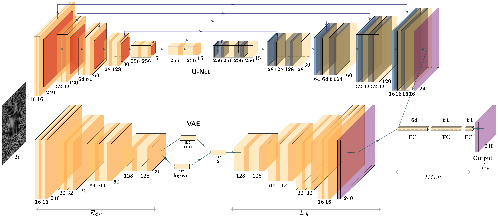

# VUDNet: From Single Shot to Structure: End-to-End Network based Deflectometry for Specular Free-Form Surface Reconstruction

This repository contains the implementation of VUDNet, a novel deep neural network designed for the end-to-end 3D reconstruction of specular free-form surfaces using single-shot deflectometry. VUDNet leverages both discriminative and generative components, specifically combining a Variational Autoencoder (VAE) with a modified U-Net, to perform depth estimation and fine-detail refinement. The network excels in challenging environments, producing highly accurate reconstructions from single-shot 2D images of reflective surfaces.

## Key Features
- **Hybrid Architecture**: VUDNet integrates a Variational Autoencoder (VAE) for coarse depth estimation and a modified U-Net for detail refinement.
- **Single-Shot Deflectometry**: The network accurately interprets fringe patterns reflected from specular surfaces, reconstructing complex geometries in a single shot.
- **Extensive Simulation Dataset**: The project includes a dataset generated using Blender, capturing diverse deformed surfaces and their depth maps.

## Paper
You can find more details in the accompanying [pre-print paper]([https://www.preprints.org/manuscript/202409.1851/v1](https://www.mdpi.com/2076-3417/14/23/10824)).

## Architecture
Below is the architecture diagram of VUDNet, showing the integration of the VAE and U-Net for 3D surface reconstruction of specular surfaces:

## Run Notes:

- In the VUDNet folder, the main script to run the code is main.py. This script is the entry point for running the 3D reconstruction pipeline. A .yaml file is provided for configuring settings and parameters. You can modify the .yaml file to customize settings as per your experiment requirements. The other files in the directory are for additional experiments and may not be essential for running the main reconstruction task.
- **Simulation Environment:** The Blender file environment and associated scripts for generating the dataset are included in this repository. These files allow you to simulate reflective surfaces and generate the training data required for the model. The dataset is created using a custom Blender script that replicates complex deflectometry scenarios.

## License
This project is licensed under the MIT License - see the [LICENSE](LICENSE) file for details.

